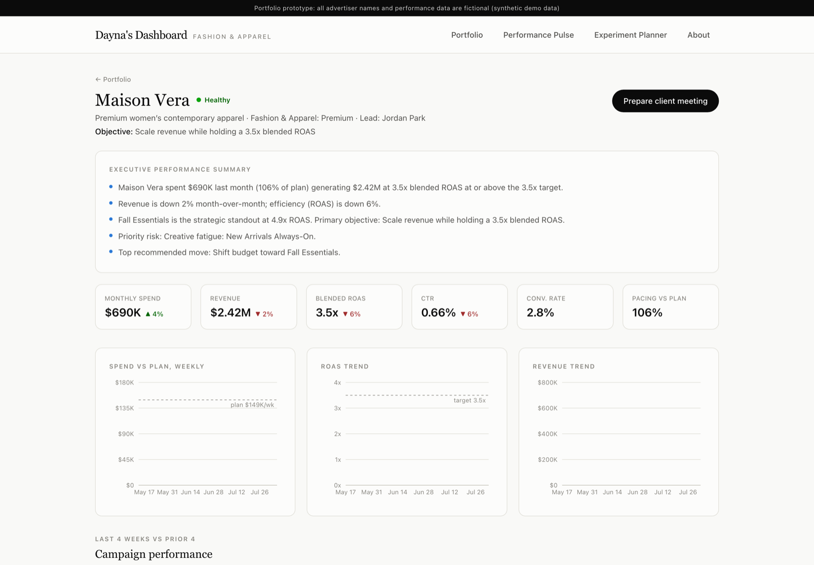
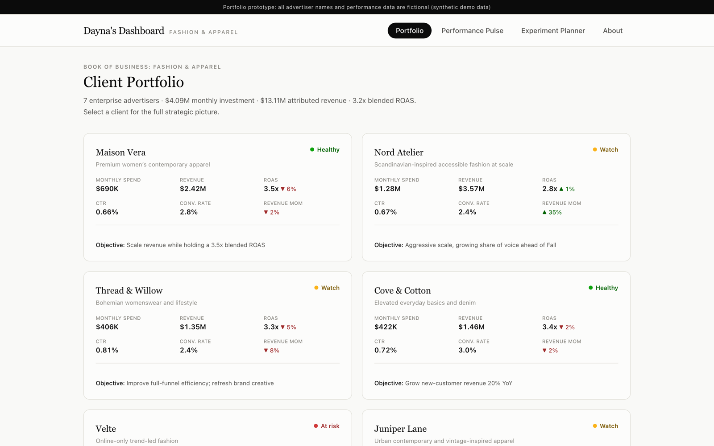
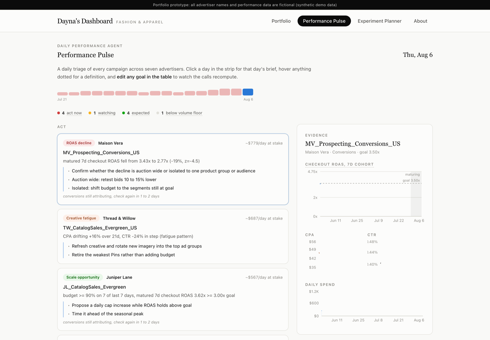

# Client Partner Copilot
### Turning campaign data into client-ready strategy for ad sales teams

[](https://daynalee.github.io/client-partner/)


**Live: https://daynalee.github.io/client-partner/**

A portfolio prototype exploring how AI could help digital advertising **Client Partners** turn
campaign performance data into strategic recommendations, client-ready insights, meeting
preparation, and growth opportunities: built around a fictional book of enterprise
**fashion & apparel** advertisers.

> **Disclaimer:** All advertiser names, campaigns, and performance data are fictional and
> generated for demonstration purposes only. No real company data is used or implied. This is
> an independent portfolio project, not affiliated with or endorsed by any advertising platform.

[](https://daynalee.github.io/client-partner/)

## Why I built this

Client Partners spend a large share of their week on manual account analysis: pulling
reports, hunting for the story in the numbers, and reformatting it for meetings. The
strategic work (what to do about the numbers, and how to say it to a client) is where a
Client Partner actually earns their seat at the table.

This prototype automates that first pass. Every recommendation, talking point, and email in
the tool is derived from the underlying campaign data by explicit rules: the same signals an
experienced Client Partner scans for: freeing the human for the part machines can't do: the
client conversation.

## What it does

- **Client Portfolio**: a book of 7 fictional fashion advertisers with spend, revenue, ROAS,
  CTR, conversion rate, MoM growth, health status, and business objective.
- **Client Detail**: executive summary, spend vs. plan, ROAS and revenue trends, campaign
  table with out/underperformer flags, creative and audience breakdowns, seasonal
  opportunities, and risks.
- **Performance Pulse**: a daily triage across every campaign in the book, sorted into act,
  watching, and expected, with the revenue at stake per day, the evidence behind each call,
  and goals you can edit to watch the triage recompute.
- **AI Growth Opportunities**: 3 to 5 rule-derived recommendations per client, each with
  *what's happening* (with the actual numbers), *why it matters*, *recommended action*, and
  *expected impact*.
- **Meeting Prep Assistant**: one click generates an executive summary, agenda, wins, risks,
  questions to ask the advertiser, top recommendations, and an upsell/expansion angle.
- **Client Talking Points**: sentences a Client Partner could actually say in the room,
  filled with the account's real numbers.
- **Follow-Up Email Generator**: a copy-ready post-meeting recap with decisions and next steps.
- **Experimentation Planner**: pick a business problem (low ROAS, declining CTR, creative
  fatigue, low conversion rate, need scale, seasonal launch) and get a structured test design:
  hypothesis, setup, KPI, success criteria, duration, and a pre-agreed decision framework.

## Screens

**Client portfolio.** The full book at a glance, with health status, pacing, and the
accounts that need attention this week surfaced first.



**Performance Pulse.** A daily triage of every campaign across all seven advertisers, sorted
into act / watch / expected with the dollars at stake per day, an evidence panel behind each
call, and editable goals that recompute the triage live.



## The insight engine

The "AI" here is a deliberately transparent, deterministic rule engine (`src/lib/insights.ts`).
Each recommendation is traceable to numbers in the synthetic dataset:

| Signal | Rule | Recommendation |
|---|---|---|
| Underfunded winner | ROAS ≥ 1.2× account blend, < 16% spend share | Shift budget toward it |
| Creative fatigue | CTR down ≥ 18% over 12 weeks at stable spend | Creative refresh sprint |
| Efficiency erosion | Spend +25% MoM while ROAS −8% | Scaling guardrails + incrementality test |
| Retargeting saturation | High ROAS or heavy share, but flat impressions | Grow the audience feeding it |
| Measurement gap | Healthy CTR with implausibly low CVR | Tracking audit before media changes |
| Undervalued prospecting | Below-blend ROAS but strong new-customer growth | Holdout test, separate NC target |
| Seasonal momentum | Fall/Holiday campaign ramping above target ROAS | Pull budget forward, pre-peak |
| Funnel imbalance | Below-target account funding low-return awareness | Temporary rebalance to conversion |

The synthetic dataset (`src/data/`) is generated deterministically with believable patterns
baked in: a high-ROAS campaign with limited spend, a fatiguing hero campaign, a
scaling-but-eroding launch, saturated retargeting, growing-but-undervalued prospecting, and
seasonal ramps: across accounts spanning healthy, watch, and at-risk states.

## Stack

- React 19 + TypeScript + Vite
- Tailwind CSS 4
- Recharts
- Fully static: no backend, no API keys. Deployable to GitHub Pages as-is.

## Run it

```bash
npm install
npm run dev
```

## Build

```bash
npm run build
```
